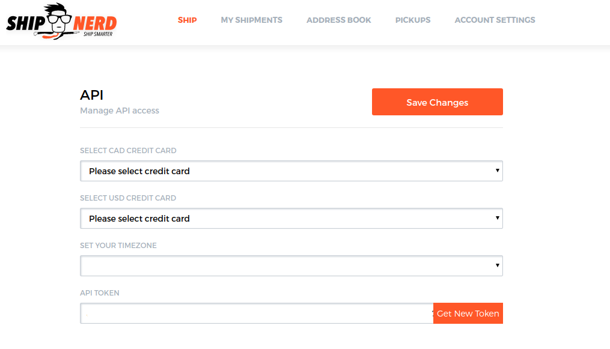

# Introduction

**Welcome to ShipNerd's API**

ShipNerd makes shipping quick, easy and affordable. No hidden fees, no volume commitments, huge discounts and we only ship with the best in the business. Get your free account today, and make the smarter shipping choice.

Our shipping API enables you to instanly obtain shipping quotes and create labels. It's quick & easy, follow the instructions and start shipping today.

# Authentication

```javascript
const request = require('request')

request.post({
    url: [API_URL],
    headers: {
      'Authorization': 'JWT [API_TOKEN]'
    },
    json: true,
    body: ...
}, function(err, response, body){}) 
```
> Make sure to replace `[API_TOKEN]` with your API token.

The API supports JWT tokens for authentication.

After you signup for a free acount, go to the "Account Settings" page and enable the API to get your token.



ShipNerd expects the API token to be included in all API requests as the Authorization header:

`Authorization: JWT [API_TOKEN]`

<aside class="notice">
You must replace <code>[API_TOKEN]</code> with your personal API token.
</aside>

# Interacting with the API

## Get Rates

> Request:

```javascript
const request = require('request');

var shipments = [];
var shipment = {
  from:{
    name: 'John Doe',
    company: 'Acme Labs',
    country: 'US',
    address1: '111 8th Ave',
    address2: '',
    zipCode: '10011',
    city: 'New York',
    state: 'NY',
    phone: '1234567890',
    email: 'john@acmelabs.com'  
  },
  to:{
    name: 'Ned Flanders',
    company: 'Simpsons Labs',
    country: 'US',
    address1: '300 Post St',
    address2: 'Suite 152',
    zipCode: '94108',
    city: 'San Francisco',
    state: 'CA',
    phone: '1234567890',
    email: 'ned@simpsons.com' 
  },
  referenceNumber: 'Nerds Rule',
  packagingType: 'your_packaging',
  packages: [{
    weight: 10,
    weightUnits: 'lbs'
  },
  {
    weight: 12,
    weightUnits: 'lbs',
    width: 12,
    length: 12,
    height: 12,
    dimensionUnits: 'in'
  }]
}
shipments.push(shipment);

request.post({
    url: "https://shipnerd.com/api/1.0/get_rates",
    headers: {
      'Authorization': 'JWT [API_TOKEN]'
    },
    body: {
      shipments: shipments
    },
    json: true
}, function(err, response, body){
    if (err){
        .....
    }
    else{
      .....
    }
}) 
```

> Response:

```json
{
  "status": true,
  "data": [
    {
      "rates": [
        {
          "carrierServiceCode": "65",
          "carrierServiceName": "UPS Next Day Air",
          "deliveryTime": "Tue December 05 by 10:30 am",
          "breakdown": {
            "transportation": "80.16",
            "accessorials": [
              {
                "name": "DELIVERY AREA",
                "price": 0
              }
            ],
            "subtotal": 80.16,
            "taxes": {},
            "total": 80.16
          },
          "currency": "USD",
          "billingWeight": 11
        },
        {
          "carrierServiceCode": "12",
          "carrierServiceName": "UPS Next Day Air Saver",
          "deliveryTime": "Tue December 05 by 03:00 pm",
          "breakdown": {
            "transportation": "69.87",
            "accessorials": [
              {
                "name": "DELIVERY AREA",
                "price": 0
              }
            ],
            "subtotal": 69.87,
            "taxes": {},
            "total": 69.87
          },
          "currency": "USD",
          "billingWeight": 11
        },
        {
          "carrierServiceCode": "08",
          "carrierServiceName": "UPS 2nd Day Air",
          "deliveryTime": "Wed December 06 by 11:00 pm",
          "breakdown": {
            "transportation": "44.15",
            "accessorials": [
              {
                "name": "DELIVERY AREA",
                "price": 0
              }
            ],
            "subtotal": 44.15,
            "taxes": {},
            "total": 44.15
          },
          "currency": "USD",
          "billingWeight": 11
        },
        {
          "carrierServiceCode": "11",
          "carrierServiceName": "UPS Ground",
          "deliveryTime": "Mon December 11 by 11:00 pm",
          "breakdown": {
            "transportation": "13.99",
            "accessorials": [
              {
                "name": "DELIVERY AREA",
                "price": 0
              }
            ],
            "subtotal": 13.99,
            "taxes": {},
            "total": 13.99
          },
          "currency": "USD",
          "billingWeight": 11
        }
      ]
    }
  ]
}


```
Returns rates for the requested shipments

### HTTP Request

`POST https://www.shipnerd.com/api/1.0/get_rates`

### Body Parameters

Parameter | Optional | Type | Description
--------- | -------- | ---- | -----------
shipments | N | Array | List of shipments. See [Shipment] (#shipment)

### Response Parameters

Parameter | Optional | Type | Description
--------- | -------- | ---- | -----------
status | N | Boolean | Status of operation
data | N | Array | Rate results. See [Rate Results] (#rate-results)

<aside class="notice">
Max number of shipments allowed per request is 10 
</aside>

## Create Labels

> Request:

```javascript
const request = require('request');

var shipments = [];
var shipment = {
  from:{
    name: 'John Doe',
    company: 'Acme Labs',
    country: 'US',
    address1: '111 8th Ave',
    address2: '',
    zipCode: '10011',
    city: 'New York',
    state: 'NY',
    phone: '1234567890',
    email: 'john@acmelabs.com'  
  },
  to:{
    name: 'Ned Flanders',
    company: 'Simpsons Labs',
    country: 'US',
    address1: '300 Post St',
    address2: 'Suite 152',
    zipCode: '94108',
    city: 'San Francisco',
    state: 'CA',
    phone: '1234567890',
    email: 'ned@simpsons.com' 
  },
  referenceNumber: 'Nerds Rule',
  packagingType: 'your_packaging',
  packages: [{
    weight: 10,
    weightUnits: 'lbs',
    width: 12,
    length: 12,
    height: 12,
    dimensionUnits: 'in'
  }],
  serviceCode: '11'
}
shipments.push(shipment);

shipments.push({
  orderId: '1512154689639',
  serviceCode: '65'
})

request.post({
    url: "https://shipnerd.com/api/1.0/create_labels",
    headers: {
      'Authorization': 'JWT [API_TOKEN]'
    },
    body: {
      shipments: shipments
    },
    json: true
}, function(err, response, body){
    if (err){
        .....
    }
    else{
      .....
    }
}) 
```

> Response

```json
{
  "status": true,
  "data": [
    {
      "orderId": "1512154689639",
      "carrier": "ups",
      "service": "UPS Next Day Air",
      "trackingNumber": "1Z4Y13A80197787255",
      "label": "https://www.shipnerd.com/api/website/label/get_pdf?orderId=1512154689639&mediaId=Byx8kFQ1Zz57cf395fc8effbb528e279b9",
      "labelExpirationDate": "Monday, December 11th, 2017 at 11:59 p.m. PST"
    },
    {
      "orderId": "1512155343427",
      "carrier": "ups",
      "service": "UPS Standard",
      "trackingNumber": "1Z3Y91E02097859784",
      "label": "https://www.shipnerd.com/api/website/label/get_pdf?orderId=1512155343427&mediaId=r1G81Y7y-G57cf395fc8effbb528e279b9",
      "labelExpirationDate": "Monday, December 11th, 2017 at 11:59 p.m. PST"
    }
  ]
}

```

Creates labels for the requested shipments

### HTTP Request

`POST https://www.shipnerd.com/api/1.0/create_labels`

### Body Parameters

Parameter | Optional | Type | Description
--------- | -------- | ---- | -----------
shipments | N | Array | List of shipments. See [Shipment] (#shipment)

### Response Parameters

Parameter | Optional | Type | Description
--------- | -------- | ---- | -----------
status | N | Boolean | Status of operation
data | N | Array | Label Results. See [Label Results] (#label-result)

<aside class="notice">
Max number of shipments allowed per request is 10 
</aside>

# Entities

## Shipment

Parameter | Optional | Type | Description
--------- | -------- | ---- | -----------
orderId | Y | String | Will be ignored in rates call. If used in create_labels call - the order will be referenced and all other fields will be ignored. Unless used with 'isUpdate' field
isUpdate | Y | Boolean | Only used together with orderId field. If set to true, all other fields must be specified (from, to, packagingType ... ). Order will be updated with new values
from | N | Object | Sender's information. See [Address] (#address)
to | N | Object | Receiver's information. See [Address] (#address)
packagingType | N | String | Available values are 'your_packaging' and 'envelope'
packages | Cond | Array | List of packages. Should be present only if 'your_packaging' is used as packagingType. See [Package] (#package)
isSignatureRequired | Y | Boolean | Is signature required
isAdultSignatureRequired | Y | Boolean | Is adult signature required
isResidentialAddress | Y | Boolean | Is residential address
referenceNumber | Y | String | Must be up to 30 chars
serviceCode | N | String | Desired service code for creating the label. Must be a valid service code for the specific shipment. Will be ignored in rates call.
customsInfo | Cond | Object | Should be present for international shipments. See [Customs] (#customs)

## Address

Parameter | Optional | Type | Description
--------- | -------- | ---- | -----------
name | N | String | Must be up to 35 chars
company | Y | String | Must be up to 35 chars
address1 | N | String | Must be up to 35 chars
address2 | Y | String | Must be up to 35 chars
city | N | String | Must be up to 30 chars
state | Cond | String | 2 letters state code. Mandatory only for countries with states.
zipCode | N | String | A valid zip code for the address
country | N | String | 2 letters country code. Must be a supported origin and destination. Please check 'Ship Page' for more information.
phone | N | String | Must be between 10-15 chars including 10 digits
email | N | String | A valid email address

## Package

Parameter | Optional | Type | Description
--------- | -------- | ---- | -----------
weight | N | Number | For 'lbs' min value is 2 and max value is 150. For 'kgs' min value is 1 and max value is 68
weightUnits | N | String | Available values are 'lbs' and 'kgs' (Please use lowercase)
length | Y | Whole Number | Must be used together with 'width' & 'height' fields. For 'in' max value is 108. For 'cm' max value is 270. 
width | Y | Whole Number | Must be used together with 'length' & 'height' fields
height | Y | Whole Number | Must be used together with 'width' & 'length' fields
dimensionUnits| Cond | String | Must be used when dimensions are specified. 'lbs' must be used with 'in' and 'kgs' must be used with 'cm'
value | Y | Number | Declared value of package

## Customs

Parameter | Optional | Type | Description
--------- | -------- | ---- | -----------
isFreeDomicile | Y | Boolean | Sets the shipment as free domicile. Works only if free domicile is enabled for user's account.
chargeAccount | Y | Object | Sets the account to charge duties and taxes on free domicile shipments. See [ChargeAccount] (#charge-account) 
documents | Y | Object | Describes a documents shipment. See [Documents] (#documents)
commodities | Y | Object | Describes a non-documents shipment. See [Commodities] (#commodities)

## Documents

Parameter | Optional | Type | Description
--------- | -------- | ---- | -----------
type | N | String | Available values are 'Documents With No Commercial Value', 'Letters and Cards', 'Interoffice Memos' and 'Business Correspondence' (Please use same case)
value | N | Number | Value of documents. If 'Documents With No Commercial Value' was set as type field - value must be 0

## Commodities

Parameter | Optional | Type | Description
--------- | -------- | ---- | -----------
reasonForExport | N | String | Available values are 'commercial', 'gift', 'sample', 'return', 'repair', 'personal_effects' and 'personal_use' (Please use lowercase)
commodities | N | Array | List of commodities. See [Commodity] (#commodity)

## Commodity

Parameter | Optional | Type | Description
--------- | -------- | ---- | -----------
description | N | String | Must be up to 35 chars and include at least 2 words
hsCode | Y | String | Must be between 6 to 14 chars
manufactureCountry | N | String | 2 letters country code
quantity | N | Whole Number | Number of pieces
quantityUnits | N | String | Available values are - 'EA' = each, 'PCS' = pieces and 'PRS' = pairs (Please use same case)
weight | N | Number | Commodity weight
weightUnits| N | String | Available values are 'lbs' and 'kgs'. Must be the same unit as the packages' weight 
value | N | Number | Value of commodity

## Charge Account

Parameter | Optional | Type | Description
--------- | -------- | ---- | -----------
accountNumber | N | String | Account number
postalCode | N | String | Registered account postal code
countryCode | N | String | Registered account country code

## Rate Results

Parameter | Optional | Type | Description
--------- | -------- | ---- | -----------
rates | N | Array | List of rates. See [Rate] (#rate) 

## Rate

Parameter | Optional | Type | Description
--------- | -------- | ---- | -----------
carrierServiceCode | N | String | The carrier serivce code
carrierServiceName | N | String | The carrier service name
deliveryTime | N | String | The estimated delivery time
breakdown | N | Object | Rate breakdown. See [Breakdown] (#breakdown)
currency | N | String | Rate currency
billingWeight | N | Number | The Billing weight rate is based on

## Breakdown

Parameter | Optional | Type | Description
--------- | -------- | ---- | -----------
transportation | N | Number | Transportation price
accessorials | N | Array | List of accessorials. See [Accessorial] (#accessorial)
taxes | N | Object | Taxes breakdown. See [Tax] (#tax)
subtotal | N | Number | Subtotal price
total | N | Number | Total price

## Accessorial

Parameter | Optional | Type | Description
--------- | -------- | ---- | -----------
name | N | String | Accessorial name
price | N | Number | Accessorial price

## Tax

Parameter | Optional | Type | Description
--------- | -------- | ---- | -----------
name | N | String | Tax name
price | N | Number | Tax price
percentage | N | Number | Tax percentage

## Label Results

Parameter | Optional | Type | Description
--------- | -------- | ---- | -----------
orderId | N | String | The created order ID
carrier | N | String | Carrier name
service | N | String | Service name
trackingNumber | N | String | Shipment tracking number
label | N | String | Url to the generated label
labelExpirationDate | N | String | Label expiration date

# Limits

## Get Rates

Max of 15 requests per 1 minute per client. 

## Create Labels

Max of 5 requests per 1 minute per client.

<aside class="notice">
Additional requests will result in an HTTP 429 (Too Many Requests) error.
</aside>